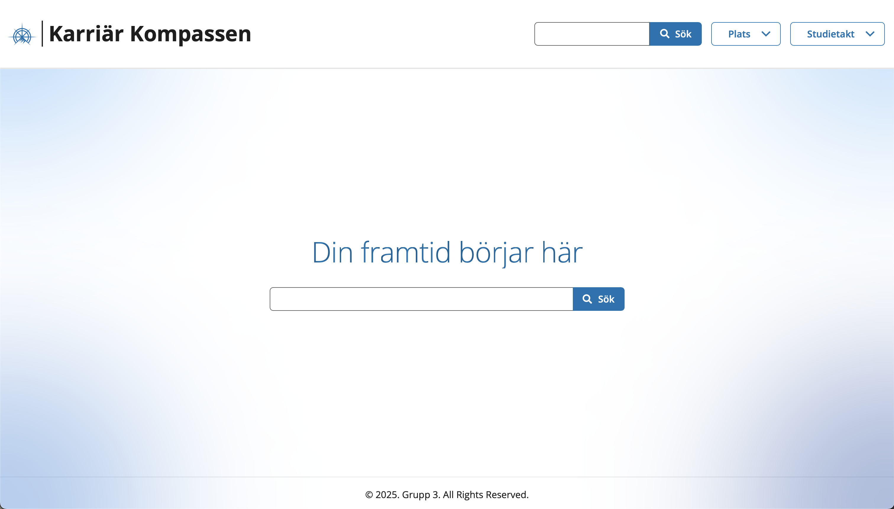
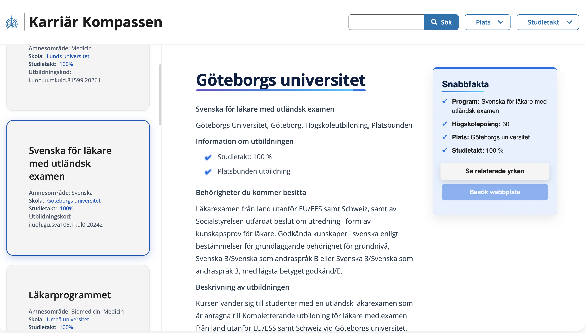

# CaseAF – Education & Job Finder

**Personal Fork for Portfolio**  
This is my personal copy of a group project originally developed at Medieinstitutet.  

A platform for discovering educational programs and related careers in Sweden. Users can search for occupations (e.g., "läkare"), view associated study programs, and explore related job opportunities.

---

## 🚀 Features

- Search for occupations and study programs in Sweden.
- View detailed information about each education (school, study pace, subject area, program code).
- Explore related jobs for each educational program.
- Dynamic filters and dropdowns for fast navigation.
- Responsive and clean front-end layout.

---

## 🛠 Tech Stack

- **Frontend:** React, TypeScript, Tailwind CSS, React Router, React Slick  
- **APIs:** Jobtech Dev APIs (Jobs & Educations)  
- **State Management:** React Context  
- **Other Libraries:** @digi/arbetsformedlingen, Framer Motion (animations)  
- **Bundler / Build Tool:** Vite  
- **Linting & Formatting:** ESLint  

---

## 🖌 My Role

I was responsible for multiple aspects of the front-end:  

- **Landing page** and overall layout design.  
- Styling and visual polish using **Tailwind CSS**.  
- Components: **InfoBox**, **Description**, **EducationCard**.  
- Integrating and testing API calls to fetch jobs and educations.  
- Ensuring **responsive design** and adherence to the design system.  

---

## 📸 Screenshots

Landing Page:  


Education Page:  


---

## 💻 Installation & Running Locally

```bash
# Clone the repo
git clone https://github.com/Novaav/Novaav-fed24-case-group-3.git
cd Novaav-fed24-case-group-3

# Install dependencies
npm install

# Run the development server
npm run dev
